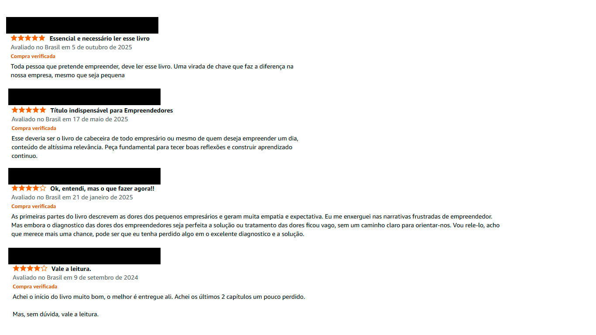

# Análise de Sentimentos com o Chat GPT.
Análise de sentimentos é um processo de processamento de linguagem natural (PLN) que utiliza algoritmos e machine learning para analisar grandes volumes de texto e identificar o tom emocional por trás dele.
---
**Olá! Me chamo Marcos Aleixo, e vou demonstrar o uso do Chat GPT para fazer análise de textos e realizar as seguntes tarefas:**
- análise de sentimentos (satisfação)
- reconhecimento de entidades nomeadas
- extração de frases-chave 
- extração de informações pessoais
- resumo de texto
- entre outros
---
Neste momento, o foco principal é analizar opiniões de clientes da amazon sobre um livro adquirido.
---
## Avaliação dos Clientes

---
## Resultado da análise de sentimento (Satisfação)

